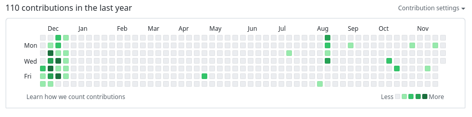

# Advent of Code 2022 Submissions

Each year my github heat map gets hot as I attempt to do as many AoC submissions as possible. 

## Implementation Goals

I have multiple goals for this year:
- Implement solutions using python
- All code passes with a pylint score of 10
- Complete both parts (obvious)
- Adopt the python class/object structure
- 

## Submissions
- [Day 01](./day01)
